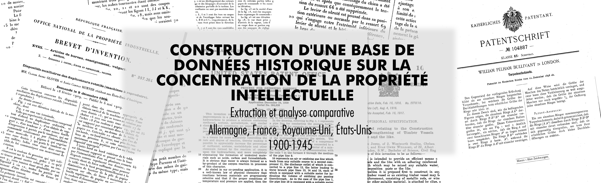

This repository contains the code used in my Master's thesis at EPFL, LHST Lab (2025).
The tools developed here are designed to process and analyze patent data, focusing on the extraction of information from patent documents from images with OCR and NLP, classification of patents using CPC classification, and clustering inventors/assignee...
# PatentData Repository Structure
```
📦 PatentData
├─ clustering
│  └─ clustering.py
├─ processing
│  ├─ classification
│  │  └─ multiclass_pytorch.py
│  ├─ extractio
│  │  ├─ ID2Dates
│  │  │  └─ german_dates.ipynb
│  │  ├─ llm
│  │  │  ├─ compare_json.ipynb
│  │  │  ├─ gemma.ipynb
│  │  │  ├─ google_api.ipynb
│  │  │  ├─ LambdaLabda_api.ipynb
│  │  │  └─ OpenAI_api.ipynb
│  │  └─ spacy
│  │     ├─ run_spacy.py
│  │     ├─ spacy_de.ipynb
│  │     ├─ spacy_fr.ipynb
│  │     ├─ spacy_gb.ipynb
│  │     └─ spacy.ipyb
│  ├─ ocr
│  │  ├─ page_labels
│  │  │  ├─ create_dataloader.py
│  │  │  ├─ create_model.py
│  │  │  └─ preditct_type.py
│  │  ├─ parellel_start.py
│  │  └─ tesseract_pipeline.py
│  ├─ scraper
│  │  ├─ fetch_pdf_us.ipynb
│  │  └─ google_patents_scrape.py
│  └─ upload
│     ├─ aggregate.py
│     ├─ classification_predictor.py
│     ├─ import_json.py
│     ├─ import_txt.py
│     ├─ schema.csv
│     └─ upload_text.py
├─ images
│  └─ banner.png
├─ README.md
├─ thesis.pdf
└─ requirements.txt
```
# Installation
To run the code in this repository, you need to install the required packages. You can do this by running the following command in your terminal:
```bash
pip install -r requirements.txt
```
The dataset is contained in MongoDB, you can run one in a docker container:
```bash
docker run --name mongodb -d -p 27017:27017 mongo
```

You then need to import the dataset into MongoDB. To load the .dump file, you can use the following command:
```bash
mongorestore --db patentdata --drop /path/to/patentdata.dump
```

The dataset is available in the `patentdata.dump` file, which can be found ????.

